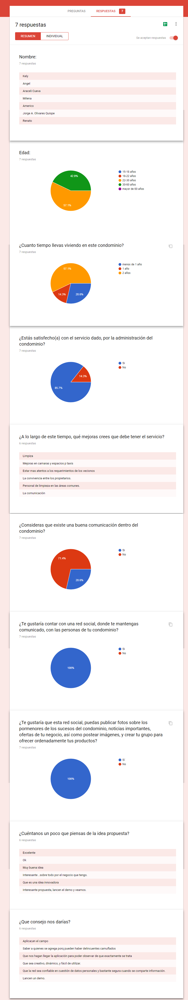
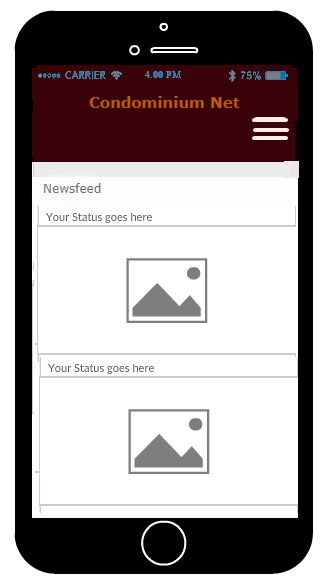
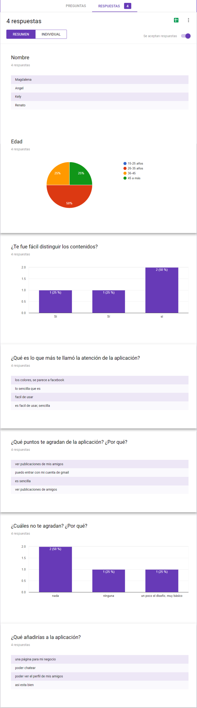
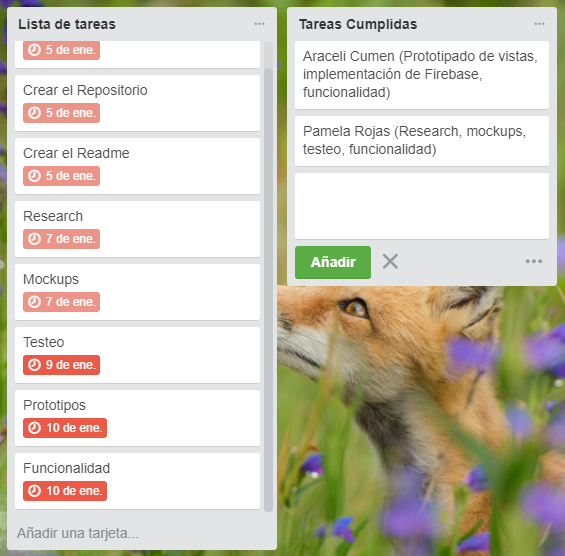

# Red Social: Condominium NET
Unidad: Producto Final
***
#### Alumnas:
  - Araceli Cumen Cueva
  - Pamela Rojas Vega

#### Squad:
The Code Sisterhood
***

## Herramientas a usar

- HTML5
- CSS3
- JS
- jQuery 3.2.1
- Materialize
- Firebase

## Requerimientos

Para llevar a cabo este proyecto se deberá cumplir con lo siguiente:

- Trabajar en parejas
- Tener una planificación
- La definición del diseño
- Diseño mobile friendly
- Desplegar el producto en Github Pages
- Opcional, si se desarrolla un login o se desea almacenar la información en una base de datos, usar Firebase.

## Research a los usuarios

- Público-meta : Residentes del Condominio Puertas de Tingomaría
- Ubicación: Sgto. Antonio Lishner 1798, Cercado de Lima 15082
- Recurso utilizado: Google Docs

Llevamos a cabo una encuesta consistente en 10 preguntas a un grupo de 7 personas para poder identificar la principal problemática a solucionar. Los resultados obtenidos fueron los siguientes:

- Encuesta: https://docs.google.com/forms/d/e/1FAIpQLSene8BPHSungCTY59tX9gEL2xaG_aXceKAT0CzPGVeb69J1qA/viewform?usp=sf_link

## Análisis del research

  - El servicio dado por el condominio tiene un gran rango de aceptación (85%).
  - Las recomendaciones dadas en la pregunta 5, por los residentes, son quejas desatendidas por la administración del condominio desde hace ya un tiempo. Al no realizarse retrospectivas ni haber una comunicación adecuada entre manager-propietarios, no es posible recabar este feedback ni darle solución al problema.
  - De la pregunta 6 observamos que nuestros encuestados son conscientes en su mayor parte (70%) de esta deficiencia en el servicio que adquirieron.
  - La primera solución que aportamos fue recibida con agrado (100%), una red social desarrollada exclusivamente para los residentes del condominio (2400 personas aprox). Una manera de mejorar la convivencia entre manager-residentes, acelerar los tiempos de comunicación y minimizar los recursos a ser usados para ello.
  - Actualmente, dentro del condominio se utiliza la aplicación Telegram para cubrir la necesidad de contacto, sin embargo, les resulta difícil de utilizar, muy impersonal y desordenado y no cumple con todas las funciones que requeriría la comunidad. Además de ello, existen varios negocios que hacen deliverys dentro de los edificios, se realizan publicaciones sobre avisos, eventos, toques de queda, etc.. y no llegan a ser recibidos por las personas que deberían ni en el tiempo que debería.
  - Creemos que el contar con una herramienta que les facilite la comunicación, a estas personas que comparten ambientes en común, les simplificaria la vida.
  - Podemos ver la aceptación de la idea en el último par de  preguntas.

## Descripción del problema
  La comunicación, en esta comunidad hace falta una herramienta que les ayude a cubrir la necesidad de interacción. Rápida y eficaz.

## Objetivos

Crear una red social teniendo en cuenta los siguientes requisitos:

  - Perfiles de usuarios
  - Un newsfeed donde puedes ver las actualizaciones de todos tus contactos
  - Un lugar donde poder escribir posts
  - Un lugar para subir fotos
  - Capacidad para poder tener amigos o para poder seguir a personas/marcas dentro de la red social
  - Ser mobile friendly

## Mockups de la Aplicacion

Flujo Visual:

## Testeo
Realizaremos una primera prueba a nuestro demo desarrollado y observaremos las reacciones de nuestro público-meta. Estos fueron los resultados obtenidos:

- Encuesta: https://docs.google.com/forms/d/e/1FAIpQLSeZxdAgPWeKw0zfuhgM-mRDmC-Zv9svsI55X9vdRnDO7r5cbQ/viewform?c=0&w=1&usp=mail_form_link

## Análisis del Feedback recibido

De las respuestas obtenidas podemos concluir lo siguiente: 

- Al 100% de encuestados se les hizo sencillo el ubicar el contenido en la aplicación. El tamaño de fuente, ubicación de botones, colores usados y demás contenido favorece a este propósito.
- Lo que más resaltó a ojos de nuestros usuarios fue el diseño básico y fácil de utilizar y la ubicación de cada elemento en la plataforma.
- Lo que más les gustó fue el hecho de que actuara como un "mini-facebook", comentario recibido por una de las usuarias. Destaca el hecho de que sea funcional y básico y también el hecho de poder ingresar con sus respectivas cuentas de gmail.
- Nuestros usuarios no encontraron detalles que les desagraden o importunasen a la hora de navegar a través de las vistas de la app, con la excepción de una funcionalidad por añadir a futuro: el poder revisar el perfil de un amigo.
- Al pensar en qué funciones les agradaría añadir a la app, surgieron dos ideas nuevas: un chat y el poder crear un perfil para un negocio local. Ambas funciones serán consideradas para incluirse en un futuro próximo. 

## Repartición de tareas y cronograma

