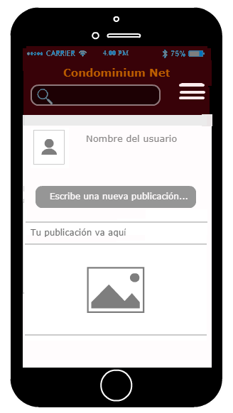

# Red Social: Condominium NET
Unidad: Producto Final
***
#### Alumnas:
  - Araceli Cumen Cueva
  - Pamela Rojas Vega

#### Squad:
The Code Sisterhood
***
## Objetivos

  Crear una red social teniendo en cuenta los siguientes requisitos:

- Perfiles de usuarios
- Un newsfeed donde puedes ver las actualizaciones de todos tus contactos
- Un lugar donde poder escribir posts
- Un lugar para subir fotos
- Capacidad para poder tener amigos o para poder seguir a personas/marcas dentro de la red social
- Ser mobile friendly

## Requerimientos

Para llevar a cabo este proyecto se deberá cumplir con lo siguiente:

- Trabajar en parejas
- Tener una planificación
- La definición del diseño
- Diseño mobile friendly
- Desplegar el producto en Github Pages
- Opcional, si se desarrolla un login o se desea almacenar la información en una base de datos, usar Firebase.

## Research a los usuarios

* Recurso utilizado: Google Docs

Llevamos a cabo una encuesta consistente en 7 preguntas a un grupo de 7 personas para poder identificar la principal problemática a solucionar. Los resultados obtenidos fueron los siguientes:

## Descripción del problema

  A raíz de los resultados se pudo determinar que el problema es la falta de comunicación entre propietarios de los distintos departamentos. No

  El condominio en el que el proyecto va evaluar el piloto es: Condominio Puertas de Tingomaría ubicado en Breña, este condominio cuenta  con 240 familias, constituidas por 5 personas aproximadamente; actualmente dentro del condominio hay varios negocios que hacen deliverys dentro del edificio, para ello emplean Telegram como herramienta de comunicación, lo cual genera una manera desordenada de adquirir productos, y poor otro lado realizar publicaciones sobre la convivencia dentro de este; además de no tener un orden al tener que legir la prioridad para ver las publicaicones importantes y necesarias den condominio.

  Creemos que el contar con una herramienta que les facilite la comunicación, a estas personas que comparten ambientes en común, les simplificaria la vida.

## Mockups de la Aplicacion

## Testeo

## Implementación de Feedback

## Desarrollo de la Apliación
